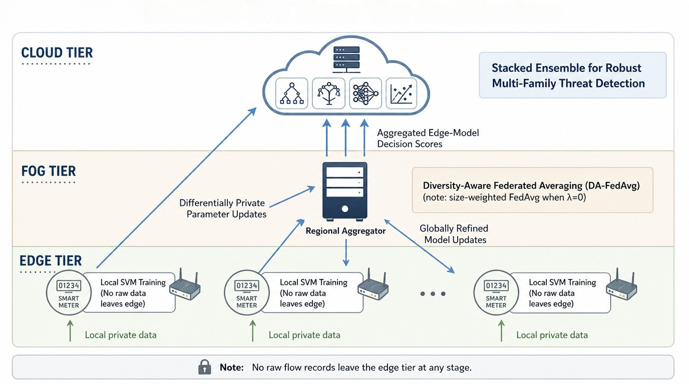
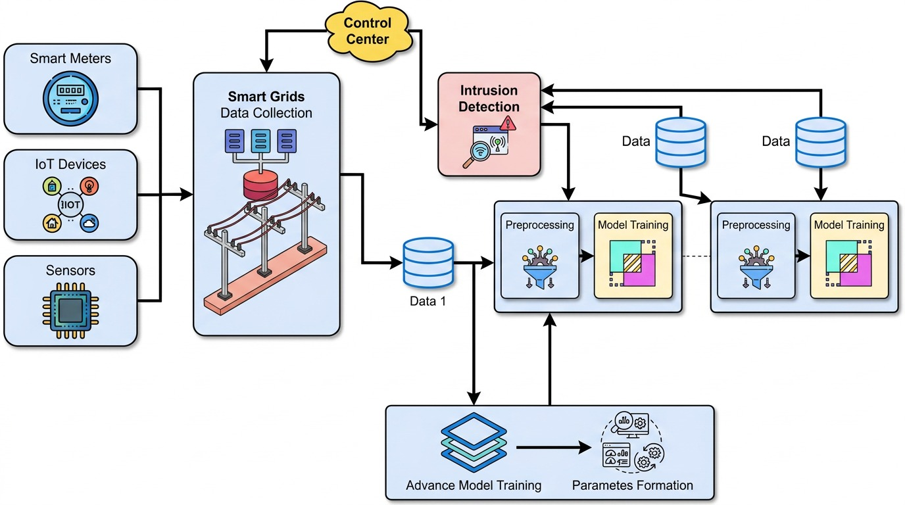

# Federated kernel SVMs with differential privacy for cooperative intrusion detection

**Code repository:** [github.com/tayyabrehman96/Federated-Kernel-SVMs-with-Differential-Privacy-for-Cooperative-Intrusion-Detection-](https://github.com/tayyabrehman96/Federated-Kernel-SVMs-with-Differential-Privacy-for-Cooperative-Intrusion-Detection-)  

**Publication:** MDPI *Sensors* — *Federated Kernel SVMs with Differential Privacy for Cooperative Intrusion Detection in Smart Meter Networks* (insert **DOI** when assigned).  

**Cite this repository:** [CITATION.cff](CITATION.cff) (GitHub “Cite this repository”).

---

## Authors and affiliations

| Author | Institution | Email |
|--------|-------------|--------|
| **Farrukh Aslam Khan** *(corresponding author)* | Center of Excellence in Information Assurance, Deanship of Scientific Research, King Saud University, Riyadh 11653, Saudi Arabia | [fakhan@ksu.edu.sa](mailto:fakhan@ksu.edu.sa) |
| **Tayyab Rehman** | Department of Information Engineering, Computer Science, and Mathematics, University of L’Aquila, 67100 L’Aquila, Italy | [tayyab.rehman@graduate.univaq.it](mailto:tayyab.rehman@graduate.univaq.it) |
| **Noshina Tariq** | Department of Artificial Intelligence and Data Science, National University of Computer and Emerging Sciences, Islamabad 44000, Pakistan | [noshina.tariq@isb.nu.edu.pk](mailto:noshina.tariq@isb.nu.edu.pk) |
| **Jalal Almuhtadi** | Department of Computer Science, College of Computer and Information Sciences (CCIS), King Saud University, Riyadh, Saudi Arabia | [jalal@ksu.edu.sa](mailto:jalal@ksu.edu.sa) |

**Software maintenance:** [Tayyab Rehman (@tayyabrehman96)](https://github.com/tayyabrehman96). For reproducibility or implementation questions, open a **GitHub Issue** on this repository or email the corresponding author as appropriate.

---

## Scope

This project distributes **research software**: Python modules, a Jupyter notebook, two methodology figures, and a compact **`results/metrics.json`** from the federated simulation driver. It does **not** version manuscript LaTeX, bibliography files, raw benchmark corpora, intermediate preprocessing exports, or large trained weights—those remain **local** or, if you choose to share them under licence, as **attachments on a GitHub Release** for this repository (see below).

---

## 1. Problem

Large-scale **Advanced Metering Infrastructure (AMI)** expands the attack surface (e.g. DoS/DDoS, false data injection, reconnaissance) while imposing **privacy**, **bandwidth**, and **heterogeneous data** constraints. Cooperative intrusion detection should avoid centralising raw flows, yet must remain accurate under **non-IID** clients and auditable privacy mechanisms.

---

## 2. Objectives

| ID | Objective |
|----|-----------|
| **O1** | **Privacy-aware federation:** Gaussian **differential privacy** on shared statistics with **composed** budgets across rounds. |
| **O2** | **Heterogeneity:** Quantify and mitigate **non-IID** partitions (Dirichlet controls); **DA-FedAvg**, **FedProx**, and robust aggregation where evaluated. |
| **O3** | **Decision quality & interpretability:** **Stacked ensemble** on decision scores; **SHAP** for attribution. |
| **O4** | **Open implementation:** Executable pipeline, documented **dataset URLs**, and a clear policy for **weights and binaries** on **GitHub only**.

---

## 3. Methodology

**Edge** clients train **kernel SVM** surrogates and transmit **DP-perturbed** updates only. **Fog** uses **diversity-aware Federated Averaging (DA-FedAvg)**, recovering **size-weighted FedAvg** when \(\lambda{=}0\). A **cloud/fog ensemble** operates on **scores**, not raw packets. Algorithmic detail, protocols, and hyper-parameters are given in the MDPI manuscript.





---

## 4. Main reported results (from the paper)

**Table 1 — Headline performance (centralised or IID federated where noted).**

| Benchmark | Configuration | Accuracy | ROC-AUC | Comment |
|-----------|----------------|----------|---------|---------|
| CICIDS2017 | Stacked ensemble (proposed) | **0.9910** | **0.998** | Outperforms single learners; large margin vs. cited baseline (0.94 / F1 0.95) |
| CICIoT2023 | Centralised XGBoost | **0.9807** | **0.995** | ~**22** percentage-point non-IID gap under Dirichlet \(\alpha{=}0.5\) vs. federated prototypes (paper) |
| Edge-IIoT | Stacked ensemble (central) | **0.9634** | **0.9792** | Fed SVM IID **0.9410**; non-IID \(\alpha{=}0.5\) **0.8140** |

**Table 2 — CICIDS2017: ensemble vs. gradient-boosting / forests (abridged).**

| Model | Accuracy | Precision | Recall | F1 |
|-------|----------|-----------|--------|-----|
| LightGBM | 0.9899 | 0.9897 | 0.9899 | 0.9898 |
| XGBoost | 0.9898 | 0.9895 | 0.9898 | 0.9896 |
| Random Forest | 0.9903 | 0.9899 | 0.9903 | 0.9899 |
| Extra Trees | 0.9889 | 0.9883 | 0.9889 | 0.9884 |
| **Ensemble (proposed)** | **0.9910** | **0.9904** | **0.9910** | **0.9905** |
| *External baseline (cited)* | *0.9400* | *0.9440* | *0.9760* | *0.9500* |

**Table 3 — Edge-IIoT (abridged).**

| Model | Acc. | Prec. | Rec. | F1 | AUC |
|-------|------|-------|------|-----|-----|
| Central XGBoost | 0.9630 | 0.9701 | 0.9589 | 0.9645 | 0.9790 |
| Central LightGBM | 0.9612 | 0.9685 | 0.9568 | 0.9626 | 0.9771 |
| Central RF | 0.9598 | 0.9671 | 0.9541 | 0.9606 | 0.9758 |
| **Ensemble (proposed)** | **0.9634** | **0.9712** | **0.9598** | **0.9655** | **0.9792** |
| Fed SVM (IID) | 0.9410 | 0.9482 | 0.9351 | 0.9416 | 0.9541 |
| Fed SVM (non-IID) | 0.8140 | 0.8209 | 0.8074 | 0.8141 | 0.8832 |

The driver **`experiments/run_federated_revision_tables.py`** refreshes **`results/metrics.json`** for the **synthetic** federated replay (non-IID sweep, Byzantine settings, etc.); interpret those entries as complementary to the **full experimental section** in the article.

---

## 5. Positioning relative to recent literature

State-of-the-art **centralised** graph and deep networks (graph attention, hybrid KAN variants, large convolutional or Transformer IDS) often prioritise **offline accuracy** when full graphs or massive batches are available in a data centre. **This work** targets **constrained uplink** (compact SVM-style updates versus multi-megabyte checkpoints), **explicit DP accounting**, **documented non-IID stress**, and a **multi-learner ensemble in score space**. Cross-paper metrics are **not** directly comparable without aligning features, splits, and task definitions; use the article’s related-work synthesis for structured comparison.

---

## 6. Benchmarks: official sources and local layout

Download each corpus **only from its official provider** and comply with its **licence**. This repository lists **URLs** and the **directory names** expected by the training scripts after you unzip or convert files locally.

| Benchmark | Provider & download | Typical local path (after download) | Entry point in this repo |
|-----------|------------------------|--------------------------------------|---------------------------|
| **CICIDS2017** | [UNB CIC — IDS-2017](https://www.unb.ca/cic/datasets/ids-2017.html) | `experiments/CICIDS2017/*.pcap_ISCX.csv` | `experiments/CICIDS2017_code/train_cicids2017.ipynb` |
| **CICIoT2023** | [UNB CIC — IoT 2023](https://www.unb.ca/cic/datasets/iotdataset-2023.html) | Default `experiments/CICIDS2023/` or any path via **`CIC_FLOW_BENCHMARK_DIR`** | `experiments/run_cic_flow_xgboost_baseline.py` / `CICIDS2023_code/cicids2023_xgboost_trainer.py` |
| **Edge-IIoTset** | [IEEE DataPort — Edge-IIoTset](https://ieee-dataport.org/documents/edge-iiotset-new-comprehensive-realistic-cyber-security-dataset-iot-and-iiot-applications) · companion article [DOI 10.1109/TII.2022.3155656](https://doi.org/10.1109/TII.2022.3155656) | `experiments/edge_iiot/data/` (preprocessed **61-feature** flows per article) | Add your training script when wired to this dataset |

**Ingestion note:** For the PCAP-flow XGBoost path, **preprocessing** (chunked CSV read, deduplication, numeric coercion) is implemented **inside** `cicids2023_xgboost_trainer.py`; no separate preprocessing archive is required beyond the official dataset files.

---

## 7. Weights, binaries, and GitHub distribution policy

| Item | Policy |
|------|--------|
| **Default branch** | Source code, notebooks, `pm.png`, `Methodology_SM.jpg`, `results/metrics.json`, documentation within the tree. |
| **Raw CSV / PCAP-derived corpora** | **Excluded** from Git (size + licence). Obtain from the **official URLs** in §6. |
| **Trained checkpoints** (e.g. XGBoost `.json`, large pickles) | **Excluded** from ordinary commits (see `.gitignore`). Regenerate with `run_cic_flow_xgboost_baseline.py` and the notebook pipeline. |
| **Optional sharing of weights or summarized artefacts** | Use **[GitHub Releases](https://docs.github.com/en/repositories/releasing-projects-on-github/managing-releases-in-a-repository)** on **this** repository (upload zip under a version tag, describe licence and file checksums in the release notes). Everything stays under **GitHub**; no external archive is required by this policy. |

---

## 8. Quick start

```bash
git clone https://github.com/tayyabrehman96/Federated-Kernel-SVMs-with-Differential-Privacy-for-Cooperative-Intrusion-Detection-.git
cd Federated-Kernel-SVMs-with-Differential-Privacy-for-Cooperative-Intrusion-Detection-/experiments
pip install -r requirements.txt
python run_federated_revision_tables.py
```

Optional **`FED_NO_TORCH=1`** if PyTorch is not installed. For the flow-folder baseline, `pip install xgboost pandas` and run **`python run_cic_flow_xgboost_baseline.py`**. Further script-level options: **`experiments/README.md`**.

---

## 9. Discussion and future work

**Discussion:** Public IoT/IIoT datasets approximate—not replace—operator AMI traffic. **DP** protects uploads but can **flatten** probability calibration for triage. **Non-IID** skew remains the hardest federated failure mode on IoT-scale corpora.

**Future work:** Protocol-specific **IEC 60870 / DNP3 / Modbus** captures; **asynchronous** federation; **personalised** or **cluster-specialised** aggregation; stronger **model compression** for resource-constrained meters; optional **GitHub Release** bundles with frozen weights when licensing permits.

---

## Suggested GitHub “About” description

`Research code: federated kernel SVMs, differential privacy, DA-FedAvg, and ensemble IDS for smart meter networks (MDPI Sensors). Datasets via UNB CIC & IEEE DataPort; weights optional via Releases.`
